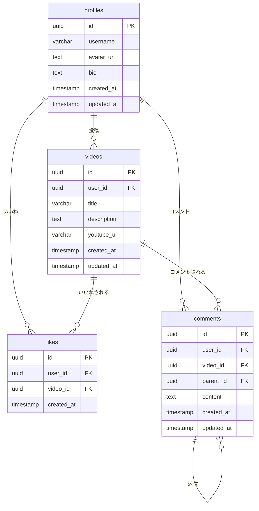

# CLAUDE.md

This file provides guidance to Claude Code (claude.ai/code) when working with code in this repository.

## プロジェクト概要

YouTube動画を使用した、Udemy風の動画講座プラットフォームMVP。
ログインユーザーが動画を投稿し、他のユーザーが視聴・コメント・いいねできるサービス。

## Commands

- `npm run dev` - Start development server with HMR
- `npm run build` - Type-check with TypeScript and build for production
- `npm run lint` - Run ESLint
- `npm run preview` - Preview production build locally

## Tech Stack

| カテゴリ | 技術 |
|---------|------|
| フロントエンド | React 18+ with TypeScript |
| ルーティング | React Router v6 |
| ビルドツール | Vite |
| スタイリング | TailwindCSS |
| コード品質 | ESLint + Prettier |
| バックエンド/DB | Supabase（認証 + PostgreSQL） |
| デプロイ | Vercel |

## ディレクトリ構成

```
src/
├── components/          # 共通コンポーネント
│   ├── common/          # ボタン、入力フォームなど
│   ├── layout/          # ヘッダー、フッターなど
│   └── video/           # 動画関連コンポーネント
├── pages/               # ページコンポーネント
│   ├── Home.tsx
│   ├── VideoDetail.tsx
│   ├── VideoNew.tsx
│   ├── VideoEdit.tsx
│   ├── Login.tsx
│   ├── Signup.tsx
│   ├── Profile.tsx
│   └── UserDetail.tsx
├── hooks/               # カスタムフック
├── lib/                 # Supabaseクライアントなど
├── contexts/            # React Context（認証状態など）
├── utils/               # ユーティリティ関数
├── App.tsx
└── main.tsx
```

## 機能要件

### 1. 認証機能

| 機能 | 詳細 |
|------|------|
| ユーザー登録 | メールアドレス + パスワード |
| ログイン | メールアドレス + パスワード |
| ログアウト | セッション破棄 |
| プロフィール編集 | アイコン画像、自己紹介文の編集 |

### 2. 動画機能

| 機能 | 詳細 |
|------|------|
| 動画投稿 | YouTube URL、タイトル、説明文を登録（ログインユーザーのみ） |
| 動画一覧表示 | カード形式で一覧表示 |
| 動画詳細表示 | YouTube埋め込みプレイヤーで再生 |
| 動画編集 | 投稿者のみ編集可能 |
| 動画削除 | 投稿者のみ削除可能 |

### 3. いいね機能

| 機能 | 詳細 |
|------|------|
| いいね | 動画に対していいね（ログインユーザーのみ） |
| いいね解除 | いいね済みの動画のいいねを取り消し |
| いいね数表示 | 動画のいいね総数を表示 |

### 4. コメント機能

| 機能 | 詳細 |
|------|------|
| コメント投稿 | 動画に対してコメント（ログインユーザーのみ） |
| コメント返信 | コメントに対して返信（スレッド形式） |
| コメント編集 | 自分のコメントのみ編集可能 |
| コメント削除 | 自分のコメントのみ削除可能 |

## 画面構成

| 画面名 | パス | 説明 | 認証 |
|--------|------|------|------|
| 動画一覧（トップ） | `/` | 動画カード一覧表示 | 不要 |
| 動画詳細 | `/videos/:id` | 動画再生 + コメント一覧 | 不要（閲覧のみ） |
| 動画投稿 | `/videos/new` | 新規動画登録フォーム | 必要 |
| 動画編集 | `/videos/:id/edit` | 動画情報編集フォーム | 必要（投稿者のみ） |
| ログイン | `/login` | ログインフォーム | 不要 |
| 新規登録 | `/signup` | ユーザー登録フォーム | 不要 |
| プロフィール | `/profile` | 自分のプロフィール編集 | 必要 |
| ユーザー詳細 | `/users/:id` | ユーザー情報 + 投稿動画一覧 | 不要 |

## データベース設計

### テーブル定義

#### profiles（Supabase Authと連携）
```sql
CREATE TABLE profiles (
  id UUID PRIMARY KEY REFERENCES auth.users(id) ON DELETE CASCADE,
  username VARCHAR(50) NOT NULL,
  avatar_url TEXT,
  bio TEXT,
  created_at TIMESTAMP WITH TIME ZONE DEFAULT NOW(),
  updated_at TIMESTAMP WITH TIME ZONE DEFAULT NOW()
);
```

#### videos（動画）
```sql
CREATE TABLE videos (
  id UUID PRIMARY KEY DEFAULT gen_random_uuid(),
  user_id UUID NOT NULL REFERENCES profiles(id) ON DELETE CASCADE,
  title VARCHAR(200) NOT NULL,
  description TEXT,
  youtube_url VARCHAR(500) NOT NULL,
  created_at TIMESTAMP WITH TIME ZONE DEFAULT NOW(),
  updated_at TIMESTAMP WITH TIME ZONE DEFAULT NOW()
);
```

#### likes（いいね）
```sql
CREATE TABLE likes (
  id UUID PRIMARY KEY DEFAULT gen_random_uuid(),
  user_id UUID NOT NULL REFERENCES profiles(id) ON DELETE CASCADE,
  video_id UUID NOT NULL REFERENCES videos(id) ON DELETE CASCADE,
  created_at TIMESTAMP WITH TIME ZONE DEFAULT NOW(),
  UNIQUE(user_id, video_id)
);
```

#### comments（コメント）
```sql
CREATE TABLE comments (
  id UUID PRIMARY KEY DEFAULT gen_random_uuid(),
  user_id UUID NOT NULL REFERENCES profiles(id) ON DELETE CASCADE,
  video_id UUID NOT NULL REFERENCES videos(id) ON DELETE CASCADE,
  parent_id UUID REFERENCES comments(id) ON DELETE CASCADE,
  content TEXT NOT NULL,
  created_at TIMESTAMP WITH TIME ZONE DEFAULT NOW(),
  updated_at TIMESTAMP WITH TIME ZONE DEFAULT NOW()
);
```

### ER図



## RLS（Row Level Security）ポリシー

### profiles
- SELECT: 誰でも閲覧可能
- UPDATE: 自分のプロフィールのみ編集可能

### videos
- SELECT: 誰でも閲覧可能
- INSERT: ログインユーザーのみ
- UPDATE: 投稿者のみ
- DELETE: 投稿者のみ

### likes
- SELECT: 誰でも閲覧可能
- INSERT: ログインユーザーのみ
- DELETE: 自分のいいねのみ

### comments
- SELECT: 誰でも閲覧可能
- INSERT: ログインユーザーのみ
- UPDATE: 投稿者のみ
- DELETE: 投稿者のみ

## 開発の進め方

### Phase 1: 環境構築
1. Vite + React プロジェクト作成
2. TailwindCSS 設定
3. ESLint + Prettier 設定
4. React Router 設定
5. Supabase プロジェクト作成・接続

### Phase 2: 認証機能
1. Supabase Auth 設定
2. ユーザー登録画面
3. ログイン画面
4. ログアウト機能
5. 認証状態管理（Context）

### Phase 3: 動画機能
1. 動画テーブル作成・RLS設定
2. 動画投稿画面
3. 動画一覧画面
4. 動画詳細画面
5. 動画編集・削除機能

### Phase 4: いいね機能
1. いいねテーブル作成・RLS設定
2. いいねボタン実装
3. いいね数表示

### Phase 5: コメント機能
1. コメントテーブル作成・RLS設定
2. コメント投稿機能
3. コメント一覧表示
4. 返信機能（スレッド形式）
5. コメント編集・削除機能

### Phase 6: プロフィール機能
1. プロフィールテーブル作成・RLS設定
2. プロフィール編集画面
3. アバター画像アップロード
4. ユーザー詳細画面

### Phase 7: 仕上げ
1. UI/UXの調整
2. エラーハンドリング
3. Vercelへデプロイ

## 環境変数

```env
VITE_SUPABASE_URL=your_supabase_url
VITE_SUPABASE_ANON_KEY=your_supabase_anon_key
```

## 非機能要件

| 項目 | 内容 |
|------|------|
| 対応デバイス | PC のみ（レスポンシブ対応なし） |
| デザイン | Udemy風のカードレイアウト |
| 管理画面 | 不要（Supabaseダッシュボードで管理） |
| 視聴履歴 | 不要 |
| 課金機能 | MVP後に実装予定 |

## 参考デザイン

- [Udemy](https://www.udemy.com/) - カードレイアウト、全体的なUI/UX
