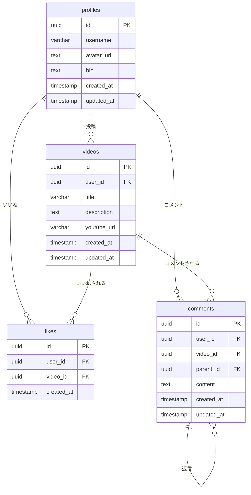

# CLAUDE.md

This file provides guidance to Claude Code (claude.ai/code) when working with code in this repository.

## プロジェクト概要

YouTube動画を使用した、Udemy風の動画講座プラットフォームMVP。
ログインユーザーが動画を投稿し、他のユーザーが視聴・コメント・いいねできるサービス。

## Commands

- `npm run dev` - Start development server with HMR
- `npm run build` - Type-check with TypeScript and build for production
- `npm run lint` - Run ESLint
- `npm run preview` - Preview production build locally

## Tech Stack

| カテゴリ        | 技術                          |
| --------------- | ----------------------------- |
| フロントエンド  | React 18+ with TypeScript     |
| ルーティング    | React Router v6               |
| ビルドツール    | Vite                          |
| スタイリング    | TailwindCSS                   |
| コード品質      | ESLint + Prettier             |
| バックエンド/DB | Supabase（認証 + PostgreSQL） |
| デプロイ        | Vercel                        |

## コーディング規約・ベストプラクティス

### React.js

#### コンポーネント設計

- **関数コンポーネント + Hooks** を使用（クラスコンポーネントは使用しない）
- **単一責任の原則**: 1コンポーネント = 1つの責務
- コンポーネントは **150行以内** を目安に分割
- **Props の型定義** は必須（interface で定義）

```tsx
// Good
interface VideoCardProps {
  video: Video;
  onLike: (id: string) => void;
}

export const VideoCard = ({ video, onLike }: VideoCardProps) => {
  // ...
};
```

#### 状態管理

- **ローカル状態**: `useState` を使用
- **グローバル状態（認証など）**: React Context + `useReducer` を使用
- **サーバー状態**: カスタムフックで管理（`useVideos`, `useComments` など）
- 状態は **必要最小限** に保つ（派生データは計算で求める）

#### カスタムフック

- ロジックの再利用には **カスタムフック** を作成
- 命名規則: `use` プレフィックス（例: `useAuth`, `useVideoLike`）
- フックは `src/hooks/` に配置

```tsx
// Good: カスタムフックでロジックを分離
export const useVideoLike = (videoId: string) => {
  const [isLiked, setIsLiked] = useState(false);
  const [likeCount, setLikeCount] = useState(0);

  const toggleLike = async () => {
    // いいね処理
  };

  return { isLiked, likeCount, toggleLike };
};
```

#### パフォーマンス最適化

- `useMemo`: 計算コストの高い値のメモ化
- `useCallback`: 子コンポーネントに渡すコールバック関数のメモ化
- `React.memo`: 再レンダリングを防ぎたいコンポーネントに使用
- **過度な最適化は避ける**（まず計測してから最適化）

#### その他のルール

- **key prop** にはユニークで安定した値を使用（index は避ける）
- **条件付きレンダリング** は早期リターンまたは三項演算子を使用
- イベントハンドラは `handle` プレフィックス（例: `handleSubmit`, `handleClick`）

### React Router v6

#### ルーティング設計

- ルート定義は `App.tsx` で一元管理
- **ネストされたルート** と `<Outlet />` を活用

```tsx
// Good: ネストされたルート構造
<Routes>
  <Route element={<Layout />}>
    <Route path="/" element={<Home />} />
    <Route path="/videos/:id" element={<VideoDetail />} />
    <Route element={<ProtectedRoute />}>
      <Route path="/videos/new" element={<VideoNew />} />
      <Route path="/profile" element={<Profile />} />
    </Route>
  </Route>
</Routes>
```

#### フック活用

- **useNavigate**: プログラム的な画面遷移
- **useParams**: URLパラメータの取得
- **useLocation**: 現在のロケーション情報
- **useSearchParams**: クエリパラメータの操作

```tsx
// Good: フックを使用したナビゲーション
const navigate = useNavigate();
const { id } = useParams<{ id: string }>();

const handleEdit = () => {
  navigate(`/videos/${id}/edit`);
};
```

#### 認証ガード

- **ProtectedRoute コンポーネント** で認証が必要なルートを保護
- 未認証時はログインページへリダイレクト

```tsx
// Good: 認証ガードコンポーネント
export const ProtectedRoute = () => {
  const { user, loading } = useAuth();
  const location = useLocation();

  if (loading) return <LoadingSpinner />;
  if (!user) return <Navigate to="/login" state={{ from: location }} replace />;

  return <Outlet />;
};
```

#### リンク

- 内部リンクは **`<Link>`** コンポーネントを使用（`<a>` タグは使わない）
- アクティブ状態が必要な場合は **`<NavLink>`** を使用

### Supabase

#### クライアント設定

- Supabaseクライアントは **シングルトン** として `src/lib/supabase.ts` で作成
- 環境変数から設定を読み込む

```tsx
// src/lib/supabase.ts
import { createClient } from '@supabase/supabase-js';
import type { Database } from '@/types/database.types';

const supabaseUrl = import.meta.env.VITE_SUPABASE_URL;
const supabaseAnonKey = import.meta.env.VITE_SUPABASE_ANON_KEY;

export const supabase = createClient<Database>(supabaseUrl, supabaseAnonKey);
```

#### 型安全性

- **Supabase CLI** で型を生成: `npx supabase gen types typescript`
- 生成した型を `src/types/database.types.ts` に配置
- クエリ結果は適切に型付け

```tsx
// Good: 型安全なクエリ
const { data, error } = await supabase
  .from('videos')
  .select('*, profiles(username, avatar_url)')
  .eq('id', videoId)
  .single();
```

#### 認証

- **onAuthStateChange** でセッション変更を監視
- AuthContext で認証状態をグローバル管理
- クリーンアップで購読解除を忘れない

```tsx
// Good: 認証状態の監視
useEffect(() => {
  const {
    data: { subscription },
  } = supabase.auth.onAuthStateChange((_event, session) => {
    setUser(session?.user ?? null);
  });

  return () => subscription.unsubscribe();
}, []);
```

#### データ取得パターン

- **SELECT**: 必要なカラムのみ指定（`*` は避ける）
- **リレーション**: 外部キーのテーブルは括弧記法で取得
- **エラーハンドリング**: 必ず error をチェック

```tsx
// Good: 必要なデータのみ取得
const { data, error } = await supabase
  .from('videos')
  .select(
    `
    id,
    title,
    youtube_url,
    created_at,
    profiles (
      username,
      avatar_url
    ),
    likes (count)
  `
  )
  .order('created_at', { ascending: false });

if (error) throw error;
```

#### リアルタイム購読

- コンポーネントのアンマウント時に **必ず購読解除**
- 購読は必要な場合のみ使用

```tsx
// Good: リアルタイム購読とクリーンアップ
useEffect(() => {
  const channel = supabase
    .channel('comments')
    .on(
      'postgres_changes',
      { event: 'INSERT', schema: 'public', table: 'comments' },
      (payload) => {
        setComments((prev) => [...prev, payload.new]);
      }
    )
    .subscribe();

  return () => {
    supabase.removeChannel(channel);
  };
}, []);
```

#### RLS（Row Level Security）

- 全テーブルで **RLS を有効化**
- クライアントからのアクセスは RLS で制御（サーバーサイドのバリデーションに頼らない）
- ポリシーはシンプルに保つ

#### ストレージ（アバター画像）

- バケット名: `avatars`
- ファイル名: `{user_id}/{timestamp}.{ext}` 形式
- アップロード前にファイルサイズ・形式をバリデーション

## ディレクトリ構成

```
src/
├── components/          # 共通コンポーネント
│   ├── common/          # ボタン、入力フォームなど
│   ├── layout/          # ヘッダー、フッターなど
│   └── video/           # 動画関連コンポーネント
├── pages/               # ページコンポーネント
│   ├── Home.tsx
│   ├── VideoDetail.tsx
│   ├── VideoNew.tsx
│   ├── VideoEdit.tsx
│   ├── Login.tsx
│   ├── Signup.tsx
│   ├── Profile.tsx
│   └── UserDetail.tsx
├── hooks/               # カスタムフック
├── lib/                 # Supabaseクライアントなど
├── contexts/            # React Context（認証状態など）
├── utils/               # ユーティリティ関数
├── App.tsx
└── main.tsx
```

## 機能要件

### 1. 認証機能

| 機能             | 詳細                           |
| ---------------- | ------------------------------ |
| ユーザー登録     | メールアドレス + パスワード    |
| ログイン         | メールアドレス + パスワード    |
| ログアウト       | セッション破棄                 |
| プロフィール編集 | アイコン画像、自己紹介文の編集 |

### 2. 動画機能

| 機能         | 詳細                                                        |
| ------------ | ----------------------------------------------------------- |
| 動画投稿     | YouTube URL、タイトル、説明文を登録（ログインユーザーのみ） |
| 動画一覧表示 | カード形式で一覧表示                                        |
| 動画詳細表示 | YouTube埋め込みプレイヤーで再生                             |
| 動画編集     | 投稿者のみ編集可能                                          |
| 動画削除     | 投稿者のみ削除可能                                          |

### 3. いいね機能

| 機能         | 詳細                                       |
| ------------ | ------------------------------------------ |
| いいね       | 動画に対していいね（ログインユーザーのみ） |
| いいね解除   | いいね済みの動画のいいねを取り消し         |
| いいね数表示 | 動画のいいね総数を表示                     |

### 4. コメント機能

| 機能         | 詳細                                         |
| ------------ | -------------------------------------------- |
| コメント投稿 | 動画に対してコメント（ログインユーザーのみ） |
| コメント返信 | コメントに対して返信（スレッド形式）         |
| コメント編集 | 自分のコメントのみ編集可能                   |
| コメント削除 | 自分のコメントのみ削除可能                   |

## 画面構成

| 画面名             | パス               | 説明                        | 認証               |
| ------------------ | ------------------ | --------------------------- | ------------------ |
| 動画一覧（トップ） | `/`                | 動画カード一覧表示          | 不要               |
| 動画詳細           | `/videos/:id`      | 動画再生 + コメント一覧     | 不要（閲覧のみ）   |
| 動画投稿           | `/videos/new`      | 新規動画登録フォーム        | 必要               |
| 動画編集           | `/videos/:id/edit` | 動画情報編集フォーム        | 必要（投稿者のみ） |
| ログイン           | `/login`           | ログインフォーム            | 不要               |
| 新規登録           | `/signup`          | ユーザー登録フォーム        | 不要               |
| プロフィール       | `/profile`         | 自分のプロフィール編集      | 必要               |
| ユーザー詳細       | `/users/:id`       | ユーザー情報 + 投稿動画一覧 | 不要               |

## データベース設計

### テーブル定義

#### profiles（Supabase Authと連携）

```sql
CREATE TABLE profiles (
  id UUID PRIMARY KEY REFERENCES auth.users(id) ON DELETE CASCADE,
  username VARCHAR(50) NOT NULL,
  avatar_url TEXT,
  bio TEXT,
  created_at TIMESTAMP WITH TIME ZONE DEFAULT NOW(),
  updated_at TIMESTAMP WITH TIME ZONE DEFAULT NOW()
);
```

#### videos（動画）

```sql
CREATE TABLE videos (
  id UUID PRIMARY KEY DEFAULT gen_random_uuid(),
  user_id UUID NOT NULL REFERENCES profiles(id) ON DELETE CASCADE,
  title VARCHAR(200) NOT NULL,
  description TEXT,
  youtube_url VARCHAR(500) NOT NULL,
  created_at TIMESTAMP WITH TIME ZONE DEFAULT NOW(),
  updated_at TIMESTAMP WITH TIME ZONE DEFAULT NOW()
);
```

#### likes（いいね）

```sql
CREATE TABLE likes (
  id UUID PRIMARY KEY DEFAULT gen_random_uuid(),
  user_id UUID NOT NULL REFERENCES profiles(id) ON DELETE CASCADE,
  video_id UUID NOT NULL REFERENCES videos(id) ON DELETE CASCADE,
  created_at TIMESTAMP WITH TIME ZONE DEFAULT NOW(),
  UNIQUE(user_id, video_id)
);
```

#### comments（コメント）

```sql
CREATE TABLE comments (
  id UUID PRIMARY KEY DEFAULT gen_random_uuid(),
  user_id UUID NOT NULL REFERENCES profiles(id) ON DELETE CASCADE,
  video_id UUID NOT NULL REFERENCES videos(id) ON DELETE CASCADE,
  parent_id UUID REFERENCES comments(id) ON DELETE CASCADE,
  content TEXT NOT NULL,
  created_at TIMESTAMP WITH TIME ZONE DEFAULT NOW(),
  updated_at TIMESTAMP WITH TIME ZONE DEFAULT NOW()
);
```

### ER図



## RLS（Row Level Security）ポリシー

### profiles

- SELECT: 誰でも閲覧可能
- UPDATE: 自分のプロフィールのみ編集可能

### videos

- SELECT: 誰でも閲覧可能
- INSERT: ログインユーザーのみ
- UPDATE: 投稿者のみ
- DELETE: 投稿者のみ

### likes

- SELECT: 誰でも閲覧可能
- INSERT: ログインユーザーのみ
- DELETE: 自分のいいねのみ

### comments

- SELECT: 誰でも閲覧可能
- INSERT: ログインユーザーのみ
- UPDATE: 投稿者のみ
- DELETE: 投稿者のみ

## 開発の進め方

### Phase 1: 環境構築

1. Vite + React プロジェクト作成
2. TailwindCSS 設定
3. ESLint + Prettier 設定
4. React Router 設定
5. Supabase プロジェクト作成・接続

### Phase 2: 認証機能

1. Supabase Auth 設定
2. ユーザー登録画面
3. ログイン画面
4. ログアウト機能
5. 認証状態管理（Context）

### Phase 3: 動画機能

1. 動画テーブル作成・RLS設定
2. 動画投稿画面
3. 動画一覧画面
4. 動画詳細画面
5. 動画編集・削除機能

### Phase 4: いいね機能

1. いいねテーブル作成・RLS設定
2. いいねボタン実装
3. いいね数表示

### Phase 5: コメント機能

1. コメントテーブル作成・RLS設定
2. コメント投稿機能
3. コメント一覧表示
4. 返信機能（スレッド形式）
5. コメント編集・削除機能

### Phase 6: プロフィール機能

1. プロフィールテーブル作成・RLS設定
2. プロフィール編集画面
3. アバター画像アップロード
4. ユーザー詳細画面

### Phase 7: 仕上げ

1. UI/UXの調整
2. エラーハンドリング
3. Vercelへデプロイ

## 環境変数

```env
VITE_SUPABASE_URL=your_supabase_url
VITE_SUPABASE_ANON_KEY=your_supabase_anon_key
```

## 非機能要件

| 項目         | 内容                                 |
| ------------ | ------------------------------------ |
| 対応デバイス | PC のみ（レスポンシブ対応なし）      |
| デザイン     | Udemy風のカードレイアウト            |
| 管理画面     | 不要（Supabaseダッシュボードで管理） |
| 視聴履歴     | 不要                                 |
| 課金機能     | MVP後に実装予定                      |

## 参考デザイン

- [Udemy](https://www.udemy.com/) - カードレイアウト、全体的なUI/UX
